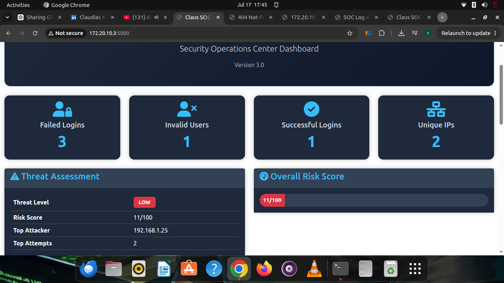
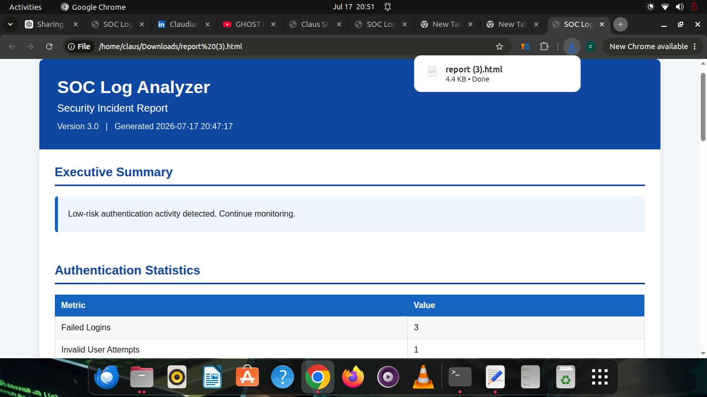
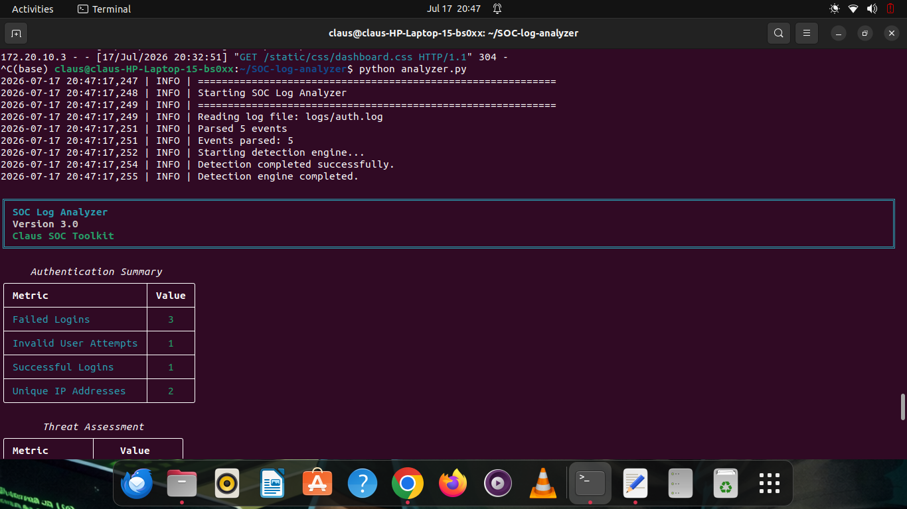

# 🛡️ SOC Log Analyzer v3.0

A professional **Security Operations Center (SOC) Log Analyzer** built with **Python** and **Flask** for detecting authentication threats, analyzing Linux security logs, generating security reports, and visualizing incidents through an interactive dashboard.

---

## 🎯 Project Goals

The SOC Log Analyzer helps security analysts:

- Detect brute-force attacks
- Detect password spraying
- Detect username enumeration
- Detect distributed login attacks
- Calculate a risk score
- Map detections to the MITRE ATT&CK framework
- Generate multiple report formats
- Visualize results through a web dashboard

---

## ✨ Key Features

- 🔐 Authentication log analysis
- 🚨 Modular detection engine
- 📊 Interactive Flask dashboard
- 🎯 MITRE ATT&CK mapping
- 📈 Risk scoring engine
- 📄 HTML reports
- 📄 JSON reports
- 📄 CSV reports
- 📄 Markdown reports
- 💡 Security recommendations
- 📥 Downloadable reports
- 🎨 Modern dark SOC dashboard
---

# 🏗️ System Architecture

```text
                Linux Authentication Logs
                         │
                         ▼
                  ┌───────────────┐
                  │  Log Parser   │
                  └───────────────┘
                         │
                         ▼
                ┌─────────────────┐
                │ Detection Engine│
                └─────────────────┘
                         │
      ┌──────────────────┼──────────────────┐
      ▼                  ▼                  ▼
Brute Force      Password Spray    Username Enumeration
      │                  │                  │
      └──────────────────┼──────────────────┘
                         ▼
                 Risk Scoring Engine
                         │
                         ▼
              MITRE ATT&CK Mapping
                         │
        ┌────────────────┼────────────────┐
        ▼                ▼                ▼
    HTML Report     JSON Report     CSV / Markdown
                         │
                         ▼
                 Flask Web Dashboard
```

---

# 📁 Project Structure

```text
SOC-log-analyzer/
│
├── analyzer.py
├── app.py
├── config.py
├── dashboard.py
├── parser.py
├── report.py
├── exporter.py
├── logger.py
│
├── detector/
│   ├── engine.py
│   ├── brute_force.py
│   ├── password_spray.py
│   ├── enumeration.py
│   ├── distributed.py
│   ├── suspicious.py
│   ├── recommendations.py
│   ├── scoring.py
│   └── utils.py
│
├── templates/
├── static/
├── reports/
├── logs/
├── tests/
└── README.md
```---

# ⚙️ Installation

Clone the repository:

```bash
git clone https://github.com/claudias94/SOC-log-analyzer.git
cd SOC-log-analyzer
```

Install dependencies:

```bash
pip install -r requirements.txt
```

---

# 🚀 Quick Start

Run the analyzer:

```bash
python analyzer.py
```

Launch the dashboard:

```bash
python app.py
```

Open your browser:

```text
http://127.0.0.1:5000
```---
## 📸 Screenshots

### Web Dashboard



---

### HTML Security Report



---

### Terminal Dashboard



# 🛠️ Technologies Used

| Category | Technologies |
|----------|--------------|
| Programming | Python 3 |
| Web Framework | Flask |
| Templates | Jinja2 |
| Frontend | HTML5, CSS3 |
| Data Formats | JSON, CSV, Markdown, HTML |
| Logging | Python Logging |
| Security | MITRE ATT&CK Framework |
| Operating System | Linux (Ubuntu) |
| Version Control | Git & GitHub |

---

# 📸 Screenshots

The project includes screenshots demonstrating:

- Dashboard Overview
- Threat Assessment
- MITRE ATT&CK Mapping
- Security Recommendations
- Generated Reports
- Rich Terminal Dashboard

Example repository structure:

```text
screenshots/
├── dashboard-home.png
├── dashboard-threats.png
├── dashboard-downloads.png
├── terminal-dashboard.png
└── html-report.png
```

---

# 🧪 Detection Capabilities

Current detection modules include:

- ✅ Brute Force Detection
- ✅ Password Spraying Detection
- ✅ Username Enumeration
- ✅ Distributed Authentication Attacks
- ✅ Suspicious Login Detection
- ✅ Risk Scoring
- ✅ MITRE ATT&CK Mapping
- ✅ Security Recommendations

---

# 📄 Generated Reports

The analyzer automatically generates:

- HTML Report
- JSON Report
- CSV Report
- Markdown Report

Reports are accessible directly from the Flask dashboard.

---

# 🚀 Future Roadmap

The SOC Log Analyzer is the first module of the **Claus SOC Toolkit**.

Upcoming modules include:

- Linux Incident Response Toolkit
- IOC Extractor
- Threat Intelligence Engine
- AI Security Assistant
- SIEM Dashboard
- Automated Threat Hunting

---

# 👤 Author

**Claudias Musavini**

Computer Security & Forensics Graduate

Cybersecurity | SOC | Python | Digital Forensics | Incident Response

GitHub:

https://github.com/claudias94

---

# 📜 License

This project is released under the MIT License.
